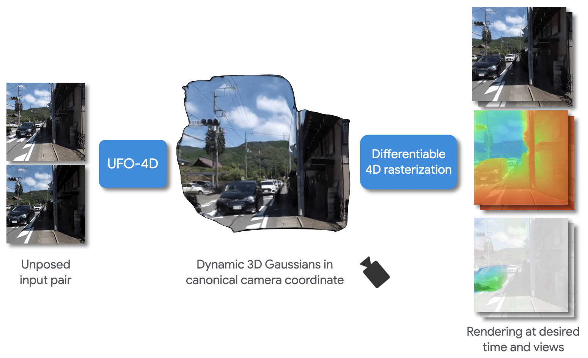

<div align="center" style="line-height:1.3; margin:0; padding:0;">
<h1 style="margin-bottom:0em;">UFO-4D: Unposed Feedforward 4D reconstruction from Two Images</h1>
<a href="https://hurjunhwa.github.io/">Junhwa Hur</a>&nbsp;&nbsp;&nbsp;
<a href="https://scholar.google.com/citations?user=LQvi5XAAAAAJ&hl=en">Charles Herrmann</a>&nbsp;&nbsp;&nbsp;
<a href="https://pengsongyou.github.io/">Songyou Peng</a>&nbsp;&nbsp;&nbsp;
<a href="https://henzler.github.io/">Philipp Henzler</a>&nbsp;&nbsp;&nbsp;
<a href="https://mazeyu.github.io/">Zeyu Ma</a>&nbsp;&nbsp;&nbsp;
<a href="https://zickler.seas.harvard.edu/">Todd Zickler</a>&nbsp;&nbsp;&nbsp;
<a href="https://deqings.github.io/">Deqing Sun</a>&nbsp;&nbsp;&nbsp;

<h3> ICLR 2026 </h3>

<h3> <a href="https://ufo-4d.github.io">[Project page]</a> &nbsp;&nbsp; <a href="https://arxiv.org/abs/2602.24290">[Paper]</a> </h3>
</div>

<div align="center">
  <p align="center">
  <a href="">
    
  </a>
</p>
</div>

> UFO-4D predicts dynamic 3D Gaussians and camera poses from a pair of unposed images in a single feedforward pass. This unified representation enables rendering of image, geometry, and motion at any intermediate view or timestamp.
---

## Installation

Download codebase.
```bash
git clone --recursive https://github.com/google-deepmind/ufo4d
cd ufo4d
```

Create conda environment and install dependencies.
```bash
conda create -y -n ufo4d python=3.11
conda activate ufo4d
# Use correct cuda version of your system.
pip3 install torch torchvision --index-url https://download.pytorch.org/whl/cu121
pip install -r requirements.txt 
cd submodule/diff-gaussian-rasterization-geometry-motion && python setup.py install
cd ../../
```

(Optional) Compile the cuda kernels for RoPE, for slightly faster runtime.
```bash
cd src/model/encoder/backbone/croco/curope/
python setup.py build_ext --inplace
cd ../../../../../..
```

## Pretrained checkpoints

Download pretrained checkpoints.
```bash
mkdir pretrained_weights
cd pretrained_weights
# NoPoSplat
wget https://huggingface.co/botaoye/NoPoSplat/resolve/main/mixRe10kDl3dv_512x512.ckpt
# MASt3R
wget https://download.europe.naverlabs.com/ComputerVision/MASt3R/MASt3R_ViTLarge_BaseDecoder_512_catmlpdpt_metric.pth
cd ..
```

## Data preparation

Our method uses [Stereo4D](https://github.com/Stereo4d/stereo4d-code), [Virtual KITTI 2](https://europe.naverlabs.com/proxy-virtual-worlds-vkitti-2/), and [PointOdyssey](https://pointodyssey.com/) for training and [Bonn](https://www.ipb.uni-bonn.de/data/rgbd-dynamic-dataset/index.html), [MPI Sintel](http://sintel.is.tue.mpg.de/), and [KITTI](https://www.cvlibs.net/datasets/kitti/eval_scene_flow.php?benchmark=flow) for evaluation.

 - Please download each dataset using each hyperlink above. For PointOdyssey, Bonn, and MPI Sintel, we use scripts from [MonST3R](https://github.com/Junyi42/monst3r/tree/main/data).
 - For Bonn, please run [this preprecssing script](https://github.com/Junyi42/monst3r/blob/main/datasets_preprocess/prepare_bonn.py) from MonST3R.
 - For PointOdyssey, please use [this script](src/dataset/pointodyssey_helper/npz_extract.py) to extract annotation for each frame.
 - Please correctly configure `train_root` and `test_root` paths of each dataset yaml file under `config/dataset`.


## Training

Run the training command (default: 4x A100 40GB).
See [config/experiment/mix3_512p.yaml](config/experiment/mix3_512p.yaml) for configuration details.
```bash
CUDA_VISIBLE_DEVICES=0,1,2,3 python -m src.main +experiment=mix3_512p logging.name=mix3_512p
```

For research exploration, please consider using 256p training setup ([config/experiment/mix3_256p.yaml](config/experiment/mix3_256p.yaml)) for faster exploration.


## Evaluation

Please configure evaluation datasets in [config/evaluation/eval_all_512p.yaml](config/evaluation/eval_all_512p.yaml).

```bash
CUDA_VISIBLE_DEVICES=0 python -m src.main +evaluation=eval_all_512p wandb.name=eval mode=test checkpointing.load=./pretrained_weights/ufo_step_120k.ckpt
```

## Demo

The demo script runs two images under the `demo_example` folder. The results will be saved under `demo_example/result`. It renders {image, depth, optical flow} at each frame's camera pose as well as interpolated camera trajectory.

```bash
CUDA_VISIBLE_DEVICES=0 python -m src.demo +evaluation=eval_all_512p logging.name=demo mode=test checkpointing.load=./pretrained_weights/ufo_step_120k.ckpt
```

## Citation

If you find this implementation useful for your projects, please cite our paper:
```bibtex
@inproceedings{Hur:2025:UFO,
  title={{UFO}-4{D}: Unposed Feedforward 4{D} Reconstruction from Two Images},
  author={Junhwa Hur and Charles Herrmann and Songyou Peng and Philipp Henzler and Zeyu Ma and Todd Zickler and Deqing Sun},
  booktitle={under review},
  year={2025},
}
```

## Acknowledgement

This project builds upon the excellent [NoPoSplat](https://github.com/cvg/NoPoSplat) codebase.

## License and disclaimer

This project is licensed under the Apache License 2.0, except for derived
components from other projects (e.g., NoPoSplat, Croco, Gaussian-Splatting).
Please check the LICENSE file for more details.

---

Copyright 2025 Google LLC

All software is licensed under the Apache License, Version 2.0 (Apache 2.0);
you may not use this file except in compliance with the Apache 2.0 license.
You may obtain a copy of the Apache 2.0 license at:
https://www.apache.org/licenses/LICENSE-2.0

All other materials are licensed under the Creative Commons Attribution 4.0
International License (CC-BY). You may obtain a copy of the CC-BY license at:
https://creativecommons.org/licenses/by/4.0/legalcode

Unless required by applicable law or agreed to in writing, all software and
materials distributed here under the Apache 2.0 or CC-BY licenses are
distributed on an "AS IS" BASIS, WITHOUT WARRANTIES OR CONDITIONS OF ANY KIND,
either express or implied. See the licenses for the specific language governing
permissions and limitations under those licenses.

This is not an official Google product.
